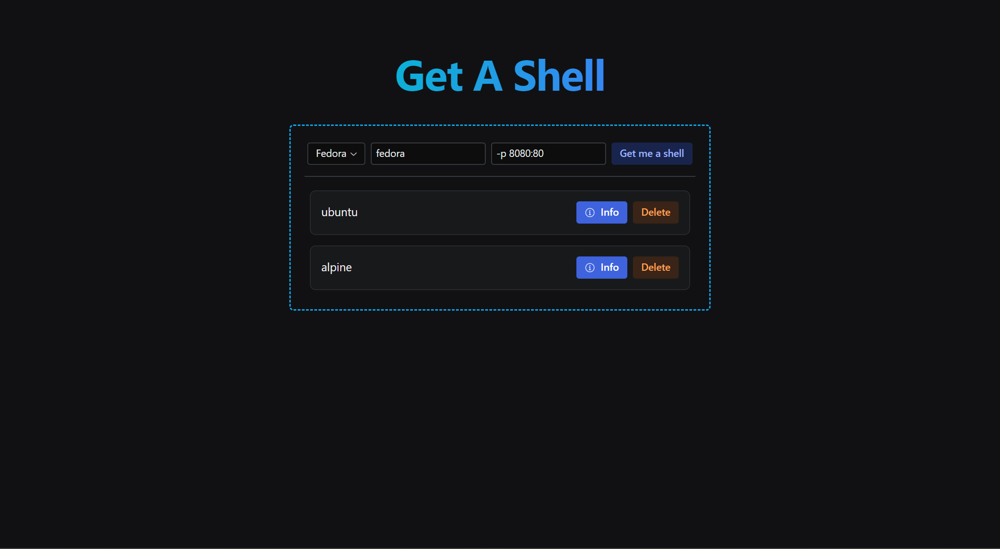

## Get A Shell 🐚

Have you ever wanted to just spin up a quick server that you can ssh into to test something real quick? Well with get a shell you can just spin up the UI select a distro and click _Get me a shell!_ and boom you have an ssh server with your specified distro. No need to spin up vms, run commands or anything harder than a click!



> Warning ⚠️: The project is **not** unmaintained, i just don't have anything else to add it. If you have a cool idea on what to include open an issue : )

> Warning ⚠️: The app is in early stages of development, I am still quite new to both writing full stack apps and using technologies like drizzle and react. Any contributions are welcome.

### Installation ⏬

The installation is very simple and straight forward. You will firstly need to generate a super secure secret key with openssl. This can be done with this command:

```Bash
openssl rand -base64 32
```

Now you simply need to take the output (which will be something like this: `0sWoIgLqYIskcvHbe4mENjj9btHKuOS3vDdYzhob6Mg=`) and put it in the [docker-compose](docker-compose.yml) file in the `SECRET_KEY` environment variable:

Finally just start the app with this command:

```Bash
docker compose up -d
```

Alternatively you can run the application with a simple docker run command, you will still need to run the openssl command and get the secret key though. Here is the full docker run command:

```Bash
docker run -t -d --name getashell --restart unless-stopped -p 3000:3000 -v ./data:/app/data -v /var/run/docker.sock:/var/run/docker.sock -e SECRET_KEY=verylongsupersecretkeythatnobodywillsee --add-host host.docker.internal:host-gateway ghcr.io/steveiliop56/getashell:latest
```

> Note 🗒️: If you don't want to run all of these commands you can install the app through [Runtipi](https://runtipi.io) which will configure everything for you.

### Contributing ❤️

As I mentioned above I am fairly new to all these technologies and my code may be _probably is_ terrifying to look at. Any contributions on fixing my mistakes (lol) are welcome. In order to get started follow the Contribution Guide [here](CONTRIBUTING.md).

### License 📜

The project is licensed under the GPL V3 License. You may modify, distribute and copy the code as long as you keep the changes in the source files. Any modifications you make using a compiler must be also licensed under the GPL license and include build and install instructions.

### Credits

[Nicolas](https://github.com/meienberger), thank you once again for helping me with workflow and docker stuff lol.
